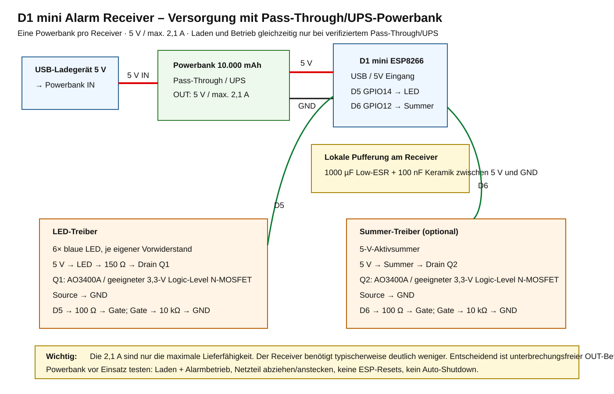
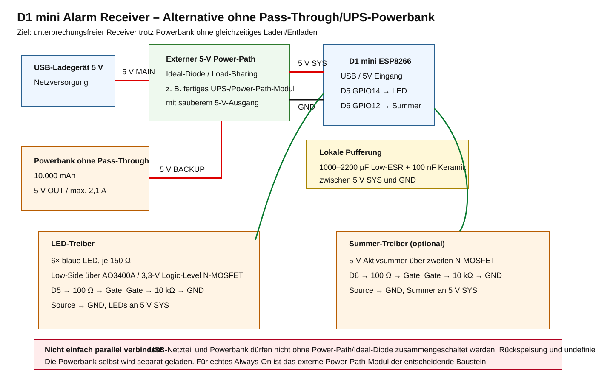

# Receiver hardware

This document defines the first receiver hardware revision for the D1 mini alert system.

## Goals

- 5 V USB powered
- one 10,000 mAh power bank per receiver
- power bank output capability: 5 V / max. 2.1 A
- blue visual alarm
- optional 5 V active buzzer
- ESP8266 GPIOs must not directly source LED or buzzer current
- non-blocking firmware operation remains possible
- receiver must remain alarm-capable while external power is present or removed

## Schematics

Recommended solution with a power bank that has verified charge-through / UPS behavior:



Alternative when the selected power bank does **not** support pass-through / UPS:



## Recommended pin assignment

| Function | D1 mini pin | ESP8266 GPIO |
|---|---:|---:|
| Blue LEDs | D5 | GPIO14 |
| Buzzer | D6 | GPIO12 |

D5 and D6 are used because they are not ESP8266 boot-strap pins.

## Visual alarm

Recommended first revision: 6 blue LEDs, each with its own series resistor, switched by one logic-level N-MOSFET.

```text
USB +5 V
  |
  +-- 150R --|>|--+
  +-- 150R --|>|--+
  +-- 150R --|>|--+
  +-- 150R --|>|--+---- Drain Q1
  +-- 150R --|>|--+       AO3400A / equivalent
  +-- 150R --|>|--+---- Source -> GND

D5/GPIO14 -- 100R -- Gate Q1
                       |
                      10k
                       |
                      GND
```

For a typical blue LED forward voltage around 3.0-3.2 V, 150 ohm at 5 V produces roughly 12 mA per LED. Six LEDs therefore use approximately 70-80 mA when continuously on.

Each LED must have its own series resistor. Do not parallel LEDs behind one shared resistor.

## Optional buzzer

Use a 5 V active buzzer so the receiver only has to switch it on/off.

```text
USB +5 V ---- (+) active buzzer (-) ---- Drain Q2
                                           |
                                      AO3400A
                                           |
                                        Source
                                           |
                                          GND

D6/GPIO12 -- 100R -- Gate Q2
                       |
                      10k
                       |
                      GND
```

If an inductive magnetic buzzer is used instead of a piezo buzzer, add a flyback diode according to the buzzer type. For a piezo active buzzer a flyback diode is normally not required.

## Receiver supply

Each receiver has its **own** 10,000 mAh power bank. The power bank is specified for 5 V / max. 2.1 A output, which provides substantial current headroom for a receiver whose expected continuous full-alarm load is only a few hundred milliamps.

The 2.1 A rating is the maximum available current, not the normal receiver current. Battery runtime is determined by the average load and usable battery energy.

### Preferred: verified pass-through / UPS power bank

If the power bank supports charge-through / UPS operation and its output stays continuously present while the charger is connected, disconnected or reconnects, use:

```text
USB charger -> power bank charge input
power bank 5 V output -> D1 mini USB / receiver 5 V rail
```

The power bank must be tested for:

- charging while the receiver remains powered
- no 5 V interruption when charger power is connected
- no 5 V interruption when charger power is removed
- no ESP8266 reset during either transition
- no automatic output shutdown during normal idle operation

Marketing terms such as "pass-through charging" are not sufficient by themselves. The actual unit must pass the transition test.

### Alternative: power bank without pass-through / UPS

Do **not** connect a normal USB charger output and the power-bank output directly in parallel.

If the power bank cannot charge and supply the receiver at the same time, add an external 5 V power-path / load-sharing stage. Its task is:

```text
                     +------------------+
USB charger 5 V ---->|                  |
                     |  5 V POWER PATH  |----> 5 V SYS -> receiver
Powerbank 5 V ------>| / ideal-diode    |
                     | / load sharing   |
                     +------------------+
```

The external stage must prevent backfeeding between the charger and power bank and provide a clean 5 V system rail during source transitions.

A suitable implementation can be a purpose-built 5 V UPS/load-sharing module or an ideal-diode/power-mux circuit designed for the required voltage and current. Do not assume a bare TP4056 charger module provides this function; a basic TP4056 board is a single-cell Li-ion charger and is not by itself a 5 V UPS power path.

With this alternative, the power bank can be charged separately when disconnected from the receiver, or a proper external power-path architecture can handle source selection. The latter is the preferred option if "always alarm-capable" is mandatory.

## Local decoupling

Add local supply buffering close to the receiver electronics:

- 1000 uF low-ESR electrolytic capacitor between 5 V and GND
- 100 nF ceramic capacitor between 5 V and GND

For source-switching experiments without guaranteed seamless transfer, 1000-2200 uF can help with short transients, but a capacitor is not a replacement for a proper power-path circuit.

## Cable voltage drop

Cheap or long USB cables can cause more trouble than the power source itself. Use short, low-resistance cables. If the receiver resets while LEDs or buzzer are active, measure the 5 V rail directly at the D1 mini under load.

## Approximate current budget

Typical design estimate for one receiver:

| Load | Approx. current |
|---|---:|
| D1 mini / ESP8266, Wi-Fi connected | 70-100 mA average |
| 6 blue LEDs | 70-80 mA when on |
| active buzzer | 20-40 mA when on |
| Total, idle | about 70-100 mA |
| Total, full continuous alarm | about 160-220 mA |

For electrical design, allow at least 300 mA continuous receiver capacity plus margin for ESP8266 Wi-Fi peaks. A 5 V / 2.1 A power bank per receiver therefore has ample current capability.

Actual hardware must be measured. The values above are engineering estimates for supply sizing, not guaranteed component specifications.

## Recommended prototype BOM

- 1x D1 mini ESP8266
- 6x blue 5 mm LED
- 6x 150 ohm resistor, 0.25 W
- 2x AO3400A or another MOSFET specified to switch the required current well at 3.3 V gate drive
- 2x 100 ohm gate resistor
- 2x 10 kohm gate pulldown resistor
- 1x optional 5 V active buzzer
- 1x 1000 uF low-ESR capacitor
- 1x 100 nF ceramic capacitor
- 1x short low-resistance USB cable
- 1x 10,000 mAh / 5 V 2.1 A power bank per receiver
- optional: 5 V power-path / ideal-diode / UPS module if the power bank has no verified pass-through function

## Acceptance test

Before fixing a PCB layout, test one complete receiver in these states:

1. Wi-Fi + MQTT connected, no alarm
2. LEDs continuously on
3. buzzer continuously on
4. LEDs + buzzer on while MQTT traffic is active
5. charger connected while receiver is running
6. charger removed while receiver is running
7. charger reconnected while receiver is running
8. receiver remains online and does not reboot through all source transitions
9. long idle test verifies that the power bank does not auto-shutdown

Record average current, minimum 5 V rail voltage and any ESP reset/reconnect events.
